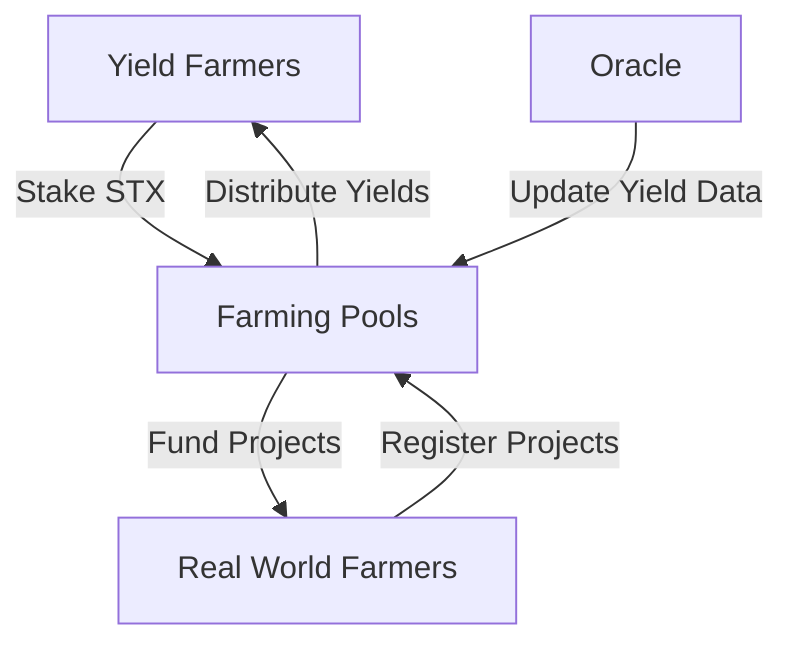

# Sustainable Yield Farming Protocol

A decentralized platform connecting crypto yield farmers with real-world agricultural projects on the Stacks blockchain. This protocol enables sustainable agriculture funding while providing crypto holders with yield farming opportunities backed by real-world agricultural yields.

## Table of Contents

- [Overview](#overview)
- [Features](#features)
- [Architecture](#architecture)
- [Prerequisites](#prerequisites)
- [Installation](#installation)
- [Usage](#usage)
- [Testing](#testing)
- [Contract Deployment](#contract-deployment)
- [Security Considerations](#security-considerations)
- [Contributing](#contributing)
- [License](#license)

## Overview

The Sustainable Yield Farming Protocol bridges the gap between DeFi yield farming and traditional agriculture by:
- Allowing farmers to access decentralized funding for sustainable agricultural projects
- Providing crypto holders with yield farming opportunities backed by real agricultural outputs
- Creating a transparent and efficient marketplace for agricultural financing

## Features

- **Smart Contract-Based Lending**
    - Automated loan issuance and repayment
    - Yield calculations based on real-world crop performance
    - Multiple pool support for different agricultural projects

- **Real-World Integration**
    - Farmer registration and verification
    - Crop yield tracking and reporting
    - Performance-based reward distribution

- **Risk Management**
    - Minimum stake requirements
    - Pool duration limits
    - Emergency shutdown capabilities
    - Owner-controlled administrative functions

## Architecture



## Prerequisites

- Node.js v16 or later
- npm or yarn
- Stacks CLI
- Clarity CLI

## Installation

1. Clone the repository:
```bash
git clone https://github.com/yourusername/sustainable-yield-farming.git
cd sustainable-yield-farming
```

2. Install dependencies:
```bash
npm install
```

3. Set up environment variables:
```bash
cp .env.example .env
# Edit .env with your configuration
```

## Usage

### For Farmers

1. Register as a farmer:
```clarity
(contract-call? .sustainable-farming register-farmer 
    u1              ;; farmer-id
    u100            ;; total-land (acres)
    "wheat"         ;; crop-type
)
```

2. Update yield estimates:
```clarity
(contract-call? .sustainable-farming update-yield-estimate
    u1              ;; farmer-id
    u5000           ;; new-estimate (bushels)
)
```

### For Yield Farmers

1. View available pools:
```clarity
(contract-call? .sustainable-farming get-pool u1)
```

2. Stake tokens:
```clarity
(contract-call? .sustainable-farming stake-tokens
    u1              ;; pool-id
    u1000000        ;; amount (microSTX)
)
```

3. Claim rewards:
```clarity
(contract-call? .sustainable-farming claim-rewards u1)
```

## Testing

Run the test suite:
```bash
npm test
```

Run specific tests:
```bash
npm test -- -t "Farmer Registration"
```

Generate coverage report:
```bash
npm test -- --coverage
```

## Contract Deployment

1. Build the contract:
```bash
npm run build
```

2. Deploy to testnet:
```bash
stx deploy_contract -t sustainable-farming.clar
```

3. Deploy to mainnet:
```bash
stx deploy_contract -m sustainable-farming.clar
```

## Security Considerations

- All funds are managed through smart contracts
- Owner-only functions for critical operations
- Emergency shutdown mechanism
- Real-time yield tracking and verification
- Minimum stake requirements to prevent spam
- Time-locked pools for stability

## Development Roadmap

### Phase 1: Core Protocol (Current)
- [x] Smart contract development
- [x] Test suite implementation
- [x] Basic frontend interface

### Phase 2: Enhanced Features
- [ ] Multiple crop type support
- [ ] Advanced yield calculations
- [ ] Automated reporting system
- [ ] Enhanced risk management

### Phase 3: Ecosystem Growth
- [ ] Cross-chain integration
- [ ] Governance implementation
- [ ] Yield insurance mechanisms
- [ ] Mobile app development

## Contributing

1. Fork the repository
2. Create your feature branch: `git checkout -b feature/amazing-feature`
3. Commit your changes: `git commit -m 'Add amazing feature'`
4. Push to the branch: `git push origin feature/amazing-feature`
5. Open a pull request

### Development Guidelines

- Follow Clarity best practices
- Add tests for new features
- Update documentation
- Follow the existing code style
- Use meaningful commit messages

## License

This project is licensed under the MIT License - see the [LICENSE](LICENSE) file for details.

## Support

For support, please:
1. Check the documentation
2. Open an issue
3. Join our Discord community
4. Email support@sustainableyield.farm

## Acknowledgments

- Stacks Foundation
- Sustainable Agriculture Foundation
- DeFi Community Contributors

---

Made with ❤️ by the Sustainable Yield Farming Team
